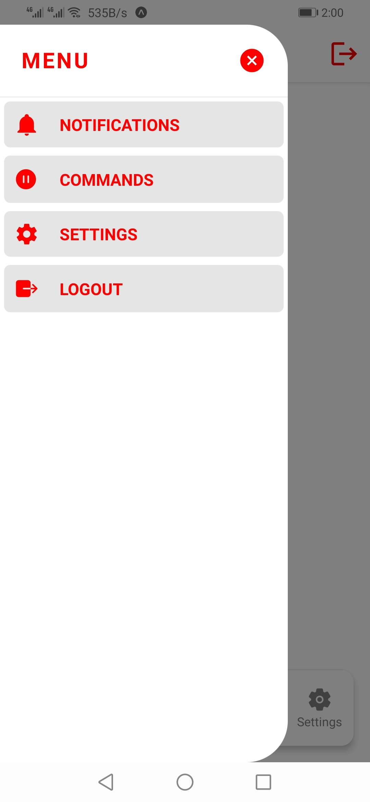

# Customization of Bottom Tabs and Drawer Navigation in React Navigation v5

# Features

- Custom Bottom Tabs
- Custom Header with custom content
- Default Drawer with custom content

## How it looks

It works both on iOS and Android!

| Bottom Tab Navigation                    | Drawer Navigation                   |
| ---------------------------------------- | ----------------------------------- |
|  |  |

### Install

```bash
git clone https://github.com/ahmaddmuneeb/custom-navigator.git
cd custom-navigator
yarn
yarn start
```

# Happy Coding :)
